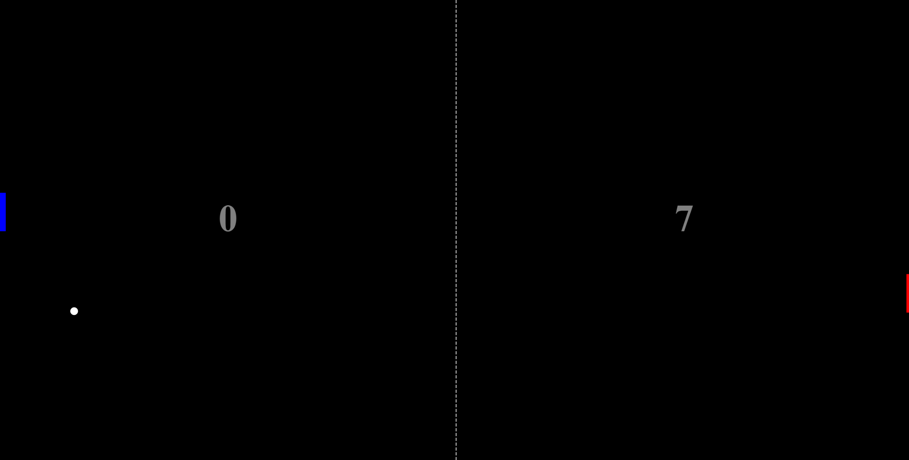

<h1 align="center"> 🎮 PING PONG GAME 🎮</h1>

Projeto feito do zero com orientação através de vídeo no youtube, porém, diferente do projeto original, decidi usar Typescript em todo o projeto para praticar o que estudei.

  <a href="#-tecnologias">Tecnologias</a>&nbsp;&nbsp;&nbsp;|&nbsp;&nbsp;&nbsp;
  <a href="#-projeto">Projeto</a>&nbsp;&nbsp;&nbsp;|&nbsp;&nbsp;&nbsp;

  

## 🚀 Tecnologias

- HTML e CSS
- TypeScript
- Git e Github

## 💻 Projeto

Jogo de ping pong.

O projeto pode ser visualizado através [desse link](https://will-g-comnisky.github.io/ping-pong-game/)